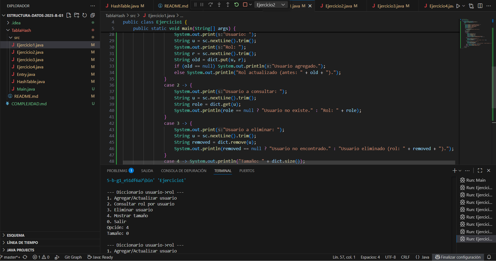
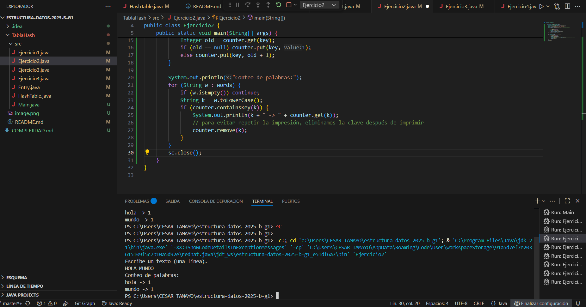
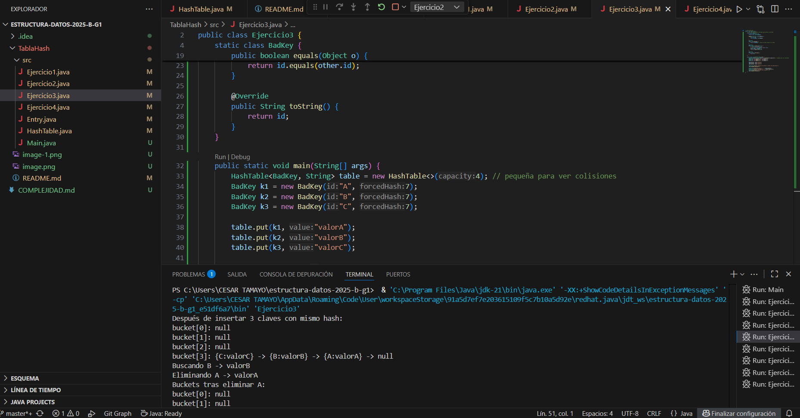

# 🧮 Taller - Implementación básica de una tabla hash

## 📝 Descripción
Este proyecto consiste en la **implementación desde cero de una tabla hash genérica `<K, V>`** en Java, utilizando **listas enlazadas (encadenamiento)** para manejar colisiones.  
El objetivo del taller es comprender cómo funciona internamente una estructura de datos tipo **HashTable**, aplicando conceptos de **funciones hash, manejo de colisiones y análisis de complejidad**.

---

## 🧠 Objetivos del taller
- Implementar una **tabla hash genérica** en Java.  
- Comprender la relación entre **claves (keys)** y **valores (values)**.  
- Aplicar **métodos de acceso, inserción y eliminación** eficientes.  
- Practicar el **uso de clases genéricas y estructuras de datos enlazadas**.  
- Evaluar el comportamiento de la tabla con diferentes escenarios de prueba.

---

## 🧩 Estructura del proyecto
TablaHash/
├── evidencias/
│ └── (capturas o reportes del funcionamiento)
├── src/
│ ├── Entry.java # Clase auxiliar para los nodos de la lista
│ ├── HashTable.java # Implementación de la tabla hash genérica
│ ├── Ejercicio1.java # Inserción y búsqueda básica
│ ├── Ejercicio2.java # Conteo de palabras con HashTable
│ ├── Ejercicio3.java # Reemplazo y validación de claves repetidas
│ ├── Ejercicio4.java # Prueba de rendimiento (size, remove, isEmpty)
│ └── Main.java # Punto de entrada opcional
├── README.md
└── COMPLEJIDAD.md # Análisis de complejidad temporal

---

## ⚙️ Funcionalidades principales
La clase `HashTable<K, V>` implementa las siguientes operaciones:

| Método | Descripción |
|--------|--------------|
| `put(K key, V value)` | Inserta un nuevo par clave-valor o actualiza el valor si la clave ya existe. |
| `get(K key)` | Devuelve el valor asociado a una clave. |
| `remove(K key)` | Elimina una entrada según su clave. |
| `containsKey(K key)` | Verifica si una clave existe en la tabla. |
| `size()` | Devuelve el número total de elementos almacenados. |
| `isEmpty()` | Indica si la tabla está vacía. |

---

## 🧪 Ejercicios de prueba

| Archivo | Descripción | Entrada / Salida esperada |
|----------|-------------|----------------------------|
| `Ejercicio1.java` | Inserta y recupera valores simples. | Inserta claves numéricas y muestra valores. |
| `Ejercicio2.java` | Conteo de palabras. | Texto: “Hola mundo hola” → `hola=2`, `mundo=1`. |
| `Ejercicio3.java` | Reemplaza valores repetidos. | Muestra cómo `put()` actualiza valores existentes. |
| `Ejercicio4.java` | Prueba de tamaño y eliminación. | `Insertados: 50`, luego `size() = 40`. |

---

## 🧩 Clases principales
### `Entry<K,V>`
Representa un nodo de la lista enlazada usada en cada posición del arreglo principal.

### `HashTable<K,V>`
Contiene un arreglo de listas enlazadas (`Entry<K,V>`) y gestiona las colisiones mediante encadenamiento.

### `Ejercicios`
Cada archivo `EjercicioN.java` prueba diferentes aspectos del comportamiento de la tabla hash.

---

## 🚀 Cómo ejecutar el proyecto
1. Abre la carpeta del proyecto en Visual Studio Code.  
2. Compila todos los archivos:
   ```bash
   javac src/*.java

## 👨‍💻 Autor
**Nombre:** César Tamayo  
**Materia:** Estructura de Datos  
**Profesor:** (Jesus Ariel Gonzales Bonilla)  
**Institución:** Corporación Universitaria Corhuila  
**Programa:** Ingeniería de Sistemas  
**Año:** 2025

EVIDENCIAS
Ejercicio 1 – Inserción y búsqueda
(EVIDENCIA1) 
(EVIDENCIA2) 
(EVIDENCIA3) 
(EVIDENCIA) 